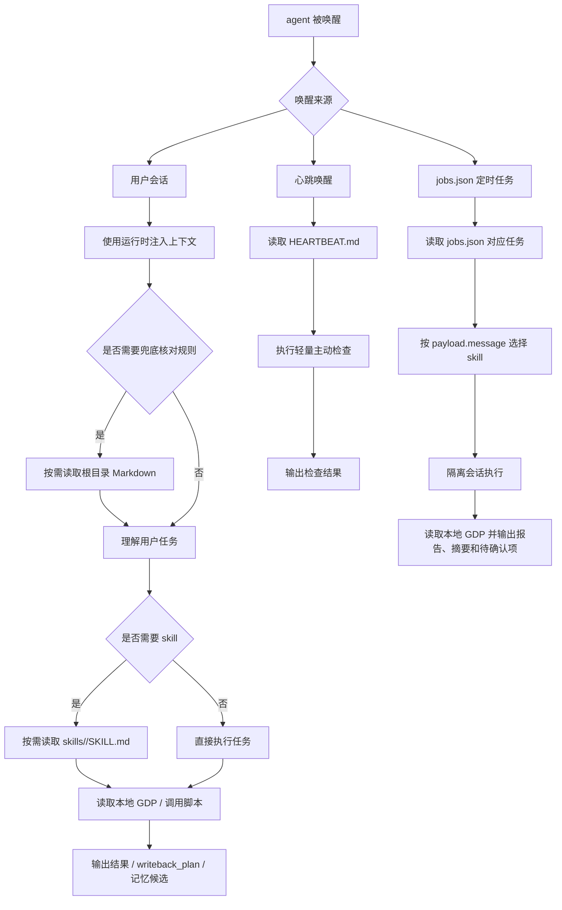

# Agent 运行时

本文档说明 `workspace-product-expert` 工作区内 agent 运行时的上下文注入、兜底加载、心跳逻辑、定时任务逻辑、技能调用逻辑和本地 GDP 写回逻辑。

## 1. 上下文注入与兜底加载

OpenClaw agent 运行时通常会自动注入身份、长期记忆、用户上下文和任务上下文。cron 的 `payload.message` 和 skill 文档不需要重复写“你是谁”“先读取 MEMORY.md”这类启动指令。

当运行环境未完成注入，或当前任务需要核对规则、工具边界、数据字典、审核口径时，agent 再按需读取 `workspace-product-expert` 根目录下的运行时 Markdown 文件：

1. `AGENTS.md`：工作区总说明、运行约定、硬性门禁、人工审核规则和技能入口。
2. `IDENTITY.md`：agent 的角色身份、服务对象和职责边界。
3. `MEMORY.md`：长期业务规则、已确认事实、默认假设、数据字典和历史沉淀。
4. `SOUL.md`：agent 的底层原则、价值判断、红线和不可突破的行为约束。
5. `TOOLS.md`：agent 可使用的工具、工具边界和调用约定。
6. `USER.md`：用户背景、业务场景、协作偏好和长期服务目标。

`HEARTBEAT.md` 不属于通用兜底加载文件。它只在心跳唤醒场景中使用。

`skill-manifest.json` 是资产索引，用来确认当前 agent 包含哪些 skill、reference、脚本和 cron 清单。

## 2. 心跳逻辑

`HEARTBEAT.md` 定义 agent 被心跳唤醒时执行的轻量检查任务。心跳频率由 OpenClaw 运行环境配置，本文档不固定具体间隔。

心跳适合处理轻量、主动、低风险的检查，例如：

- 检查当天记忆中是否有可沉淀到 `MEMORY.md` 的确认事实。
- 检查长期未确认的 FAQ、ROI 假设或规则变更。
- 检查是否存在需要提醒人工确认的轻量事项。

心跳任务不用于生成复杂业务报告，也不用于覆盖人工审核结论。若没有需要处理的事项，agent 可返回类似 `HEARTBEAT_OK` 的结果。

## 3. 定时任务逻辑

`jobs.json` 记录 agent 定时执行的命令清单。

每条定时任务通常包含：

- `name`：任务名称。
- `enabled`：是否启用。
- `schedule`：执行时间、cron 表达式和时区。
- `payload.message`：agent 被唤醒后要执行的具体任务说明。
- `sessionTarget`：是否在隔离会话中运行。
- `delivery`：执行结果的通知方式。

定时任务适合处理周期性业务动作，例如每日数据同步、每日 FAQ 汇总、每周需求质量报告、每月 ROI 报告、季度模型校准和年度知识沉淀。

定时任务运行时应遵守以下原则：

- 按任务说明读取对应 skill。
- 在隔离会话中执行，避免污染当前人工会话。
- 输出有证据支撑的报告、结构化摘要、待确认项和可沉淀结论候选。
- 不覆盖人工审核结论。
- 数据源不可用时，说明失败阶段和重试建议。

## 4. 技能调用逻辑

`workspace-product-expert/skills` 定义 agent 掌握的技能。

每个技能目录下的 `SKILL.md` 描述该技能的适用场景、输入要求、执行步骤、输出格式、错误处理和记忆写入规则。

agent 不会在每次启动时完整读取所有技能，而是按需主动调用：

1. 根据用户任务或定时任务判断业务场景。
2. 选择能完成目标的最小 skill 或 skill 链。
3. 读取对应 `skills/<skill-name>/SKILL.md`。
4. 按技能说明处理输入、调用脚本或读取数据。
5. 输出 Markdown 摘要和结构化 JSON。
6. 如产生本地 GDP 变更，输出 `writeback_plan`；如产生长期价值结论，输出记忆候选。

## 5. 本地 GDP 数据流转

`workspace-product-expert/data/` 就是本项目搭建的本地 GDP。agent 的业务事实、过程状态、文档索引、FAQ、ROI、交付和复盘数据都以这里的 JSON 表为准。

真实数据进入本地 GDP 的主要路径：

1. 客户主动导入、飞书聊天/表格提取、附件解析、人工确认、服务记录或运行数据导出。
2. 由 `inbox-normalize-skill` 或人工整理归一化为 `workspace-product-expert/data/inbox/*.json`，新记录按 `references/id-rules.md` 生成候选主键。
3. `data-sync-skill` 读取 `data/inbox/*.json`。
4. 按 `data/catalog.json` 的表名、主键和路径 upsert 到 `data/*.json`。
5. 写入 `data/sync_runs.json` 记录同步批次、写入数量、跳过数量和错误。

skill 运行中产生的结果不应随意直接覆盖业务事实。需要写回时，必须按 `references/writeback-contract.md` 输出 `writeback_plan`，说明目标表、主键、字段、来源证据、审核状态和禁止覆盖规则。

飞书聊天、会议纪要和附件解析得到的信息默认是候选事实；只有人工确认或明确审核来源才能写成已确认事实。

## 6. 运行时总体流程

## 7. 文件职责边界

| 文件或目录 | 职责 |
| --- | --- |
| `workspace-product-expert/*.md` | 运行时注入缺失或任务需要核对时的兜底上下文和运行规则。 |
| `workspace-product-expert/HEARTBEAT.md` | 心跳唤醒时的轻量主动检查规则。 |
| `workspace-product-expert/skill-manifest.json` | agent 包内 skill、reference、脚本和 cron 清单索引。 |
| `jobs.json` | 定时任务清单，定义 agent 在固定时间执行什么命令。 |
| `workspace-product-expert/skills/` | agent 可按需调用的业务技能库。 |
| `workspace-product-expert/data/` | 本项目本地 GDP，存放业务事实、过程状态、文档索引、FAQ、ROI、交付和复盘数据。 |
| `workspace-product-expert/data/inbox/` | 客户导入、飞书提取、附件解析、服务记录和运行数据的归一化待同步文件。 |
| `workspace-product-expert/memory/` | 按日期沉淀的执行痕迹、业务结论候选和复盘记录。 |
| `workspace-product-expert/references/` | 可复用的数据契约、流程、模板、公式和运行手册。 |

## 8. 核心原则

- 运行时注入优先；只有缺少注入或需要核对规则时才读取根目录运行文件。
- `HEARTBEAT.md` 只服务心跳，不作为默认启动文件。
- `jobs.json` 管理周期性、可调度的 agent 命令。
- `skills/` 是能力库，按需读取和执行，不做无关扩展。
- `data/` 是本项目的本地 GDP。
- 业务结果写回必须遵守 `references/writeback-contract.md`。
- 人工审核结论优先，agent 只能生成建议、报告、候选结论和待确认项。
